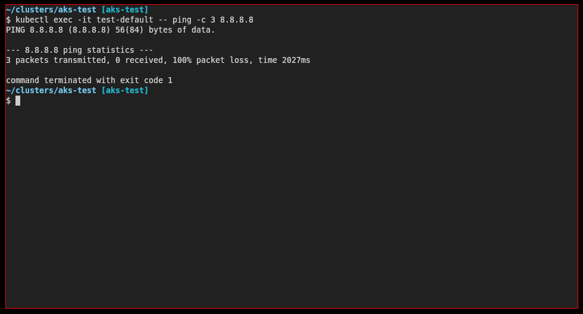
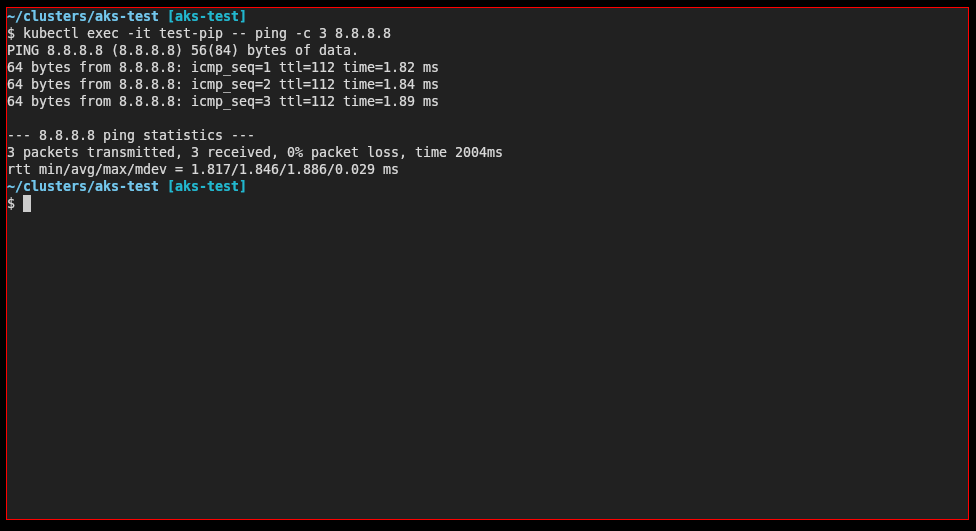
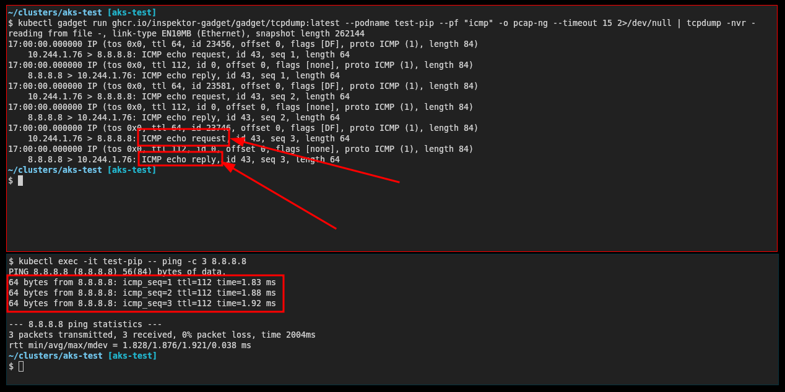
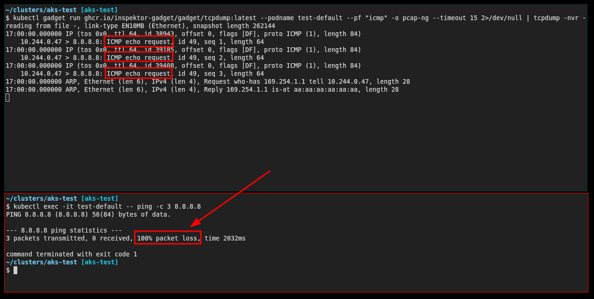

---
authors:
- diego_casati
date: '2025-11-28'
description: Why can't you ping from an AKS pod? It's not the NSG - it's asymmetric routing. Here's how to fix it.
tags:
- kubernetes
- aks
- networking
title: "Understanding ICMP Traffic on AKS"
---

# Understanding ICMP Traffic on AKS

You open a shell inside a pod, run `ping 8.8.8.8`, and nothing happens. Silence.
Then you run `curl https://www.microsoft.com` and it succeeds immediately.
DNS resolution also works normally.

So why does `ping` fail?

<!-- truncate -->

In this post we ill investigate a common misconception in Azure networking: ICMP fails from AKS pods not due to NSG blocks or routing table issues, but because Azure’s Standard Load Balancer and NAT Gateway do not perform NAT for ICMP. Without NAT state, return traffic has no mapping and is dropped.

## Research Question

Why does ICMP ping from AKS pods fail while TCP and UDP traffic succeed?

## Hypothesis

ICMP fails from AKS pods because the Azure Standard Load Balancer and NAT Gateway perform outbound SNAT only for TCP and UDP. They do not maintain NAT state for ICMP. When the ICMP Echo Reply returns, there is no NAT translation entry to match it back to the requesting pod, and it is silently dropped.

This can appear similar to asymmetric routing behavior, but the root cause is absence of ICMP NAT state, not an incorrect path.

## Experimental Setup

To validate this hypothesis, we create reproducible test conditions.

Environment summary:

* AKS cluster using Azure CNI Overlay
* Standard Load Balancer providing default outbound SNAT
* Two nodepools:

  * default nodepool without public IP
  * secondary nodepool with `--enable-node-public-ip`

The objective is to compare ICMP return behavior when traffic flows through the load balancer SNAT versus directly through a node public IP.

:::info Heads up
Check out the [Tools of the Trade: Working with Multiple Clusters](2025/11/27/tools-of-the-trade-working-with-multiple-clusters) blog post. In there, I have a walkthrough on how I setup my work environment using `direnv`. I will be using that same approach here.
:::

### Create the cluster

1. create a placeholder directory for this cluster:

```bash
mkdir -p ~/clusters/aks-test && cd ~/clusters/aks-test
```

2. Set the environment variables for the new test cluster:

```bash
cat <<EOF> .envrc
export AKS_CLUSTER_NAME="aks-test"
export RESOURCE_GROUP="rg-aks-test"
export LOCATION="westus3"
export KUBECONFIG=${PWD}/cluster.config
EOF
```

3. Either use `source` or have `direnv` load the `.envrc` for you:

```bash
source .envrc
```

4. Create the Azure Resource Group

```bash
az group create --name ${RESOURCE_GROUP} --location ${LOCATION}
```

5. Create the AKS Cluster:

```bash
az aks create \
  --name ${AKS_CLUSTER_NAME} \
  --resource-group ${RESOURCE_GROUP} \
  --node-count 1
```

6. Add a nodepool with public IP support:

```bash
az aks nodepool add \
  --resource-group ${RESOURCE_GROUP} \
  --cluster-name ${AKS_CLUSTER_NAME} \
  --name nppip \
  --node-count 1 \
  --enable-node-public-ip
```

7. Retrieve cluster credentials:

```bash
az aks get-credentials \
  --name ${AKS_CLUSTER_NAME} \
  --resource-group ${RESOURCE_GROUP} \
  --file ${KUBECONFIG}
```

8. Verify:

```bash
kubectl get nodes -o wide
```

Expect: one node with a public IP, one without (loost at the **EXTERNAL-IP** column).

```bash
NAME                                STATUS   ROLES    AGE   VERSION   INTERNAL-IP   EXTERNAL-IP     OS-IMAGE             KERNEL-VERSION      CONTAINER-RUNTIME
aks-nodepool1-17905194-vmss000000   Ready    <none>   19h   v1.32.9   10.224.0.4    <none>          Ubuntu 22.04.5 LTS   5.15.0-1098-azure   containerd://1.7.28-1
aks-nppip-33355370-vmss000000       Ready    <none>   72s   v1.32.9   10.224.0.5    20.168.37.181   Ubuntu 22.04.5 LTS   5.15.0-1098-azure   containerd://1.7.28-1
```

## Experiments

### Deploy test pods

Pod on the default nodepool:

```bash
kubectl run test-default \
  --image=nicolaka/netshoot \
  --overrides='{"spec":{"nodeSelector":{"agentpool":"nodepool1"}}}' \
  -- sleep infinity
```

Pod on the public-IP nodepool:

```bash
kubectl run test-pip \
  --image=nicolaka/netshoot \
  --overrides='{"spec":{"nodeSelector":{"agentpool":"nppip"}}}' \
  -- sleep infinity
```

### Experiment 1: ICMP testing

Default nodepool (expected failure):

```bash
kubectl exec -it test-default -- ping -c 3 8.8.8.8
```

Observation:



Public-IP nodepool (expected success):

```bash
kubectl exec -it test-pip -- ping -c 3 8.8.8.8
```

Observation:



Result table:

| Test | Default nodepool | Public-IP nodepool |
| - | - | - |
| ping 8.8.8.8 | no reply | works |
| curl https://microsoft.com | works | works |
| DNS | works | works |

### Experiment 2: Packet capture with Inspektor Gadget

[Inspektor Gadget](https://www.inspektor-gadget.io/) is a powerful tool for debugging and inspecting Kubernetes clusters. It provides a set of gadgets that can be used to trace and monitor various aspects of your cluster.

:::note
Follow the installation steps described in the Microsoft documentation: [How to install Inspektor Gadget in an AKS cluster](https://learn.microsoft.com/en-us/troubleshoot/azure/azure-kubernetes/logs/capture-system-insights-from-aks?tabs=ubuntu2204#how-to-install-inspektor-gadget-in-an-aks-cluster)
:::

Once installed, you can capture ICMP packets using the `tcpdump` gadget. Open two terminals - one to run the gadget and another to run ping from the pod.

**Terminal 1 - Capture packets from test-pip (with public IP):**

```bash
kubectl gadget run ghcr.io/inspektor-gadget/gadget/tcpdump:latest \
  --podname test-pip \
  --pf "icmp" \
  -o pcap-ng | tcpdump -nvr -
```

**Terminal 2 - Run ping:**

```bash
kubectl exec -it test-pip -- ping -c 3 8.8.8.8
```

**Observed output (ICMP working):**

```
10.244.1.76 > 8.8.8.8: ICMP echo request, id 37, seq 1, length 64
8.8.8.8 > 10.244.1.76: ICMP echo reply, id 37, seq 1, length 64
10.244.1.76 > 8.8.8.8: ICMP echo request, id 37, seq 2, length 64
8.8.8.8 > 10.244.1.76: ICMP echo reply, id 37, seq 2, length 64
```

Notice both the **echo request** and **echo reply** are captured - ICMP is working!



Now repeat the same test with `test-default` (without public IP):

**Terminal 1:**

```bash
kubectl gadget run ghcr.io/inspektor-gadget/gadget/tcpdump:latest \
  --podname test-default \
  --pf "icmp" \
  -o pcap-ng | tcpdump -nvr -
```

**Terminal 2:**

```bash
kubectl exec -it test-default -- ping -c 3 8.8.8.8
```

**Observed output (ICMP not working):**

```
10.244.0.47 > 8.8.8.8: ICMP echo request, id 42, seq 1, length 64
10.244.0.47 > 8.8.8.8: ICMP echo request, id 42, seq 2, length 64
10.244.0.47 > 8.8.8.8: ICMP echo request, id 42, seq 3, length 64
```

Only **echo requests** are captured - no replies come back. This confirms the asymmetric routing issue.



## Analysis

Azure Standard Load Balancer outbound SNAT supports only TCP and UDP. ICMP packets do not create NAT state, so no translation entry exists for returning Echo Replies. When the reply packet returns, there is no flow state to associate it with a pod, and it is silently dropped.

### Traffic flow comparison

**Without node public IP (failure):**

```
Pod --> Node --> Standard LB (SNAT TCP/UDP only) --> Internet
Internet --> Standard LB --> no ICMP NAT state --> dropped
```

**With node public IP (success):**

```
Pod --> Node --> Public IP --> Internet
Internet --> same Public IP --> Node --> Pod
```

No NAT appliance in the path means no state tracking is required and ICMP works normally.

## How to enable ICMP if needed

| Method | ICMP support | Notes |
| - | - | - |
| enable-node-public-ip | yes | direct bypass of SNAT |
| Azure Firewall | **no** | uses Standard LB internally; ICMP rules only work for VNet-to-VNet traffic |
| NVA (OpenBSD/FreeBSD PF, Palo Alto, etc.) | yes | full ICMP NAT support |
| Standard Load Balancer | no | SNAT supports TCP/UDP only |
| NAT Gateway | no | same limitation |
| NSGs | not relevant | do not influence NAT state behavior |

:::warning Azure Firewall ICMP Limitation

Despite Azure Firewall supporting ICMP in network rules, it **cannot SNAT ICMP traffic to the Internet**. This is because Azure Firewall uses the Standard Load Balancer internally for outbound connectivity. ICMP network rules only work for east-west traffic between VNets and subnets, not for north-south Internet-bound traffic.

We verified this by deploying an AKS cluster in a hub-spoke topology with forced tunneling through Azure Firewall. Even with an explicit ICMP allow rule, ping to 8.8.8.8 failed with 100% packet loss, while HTTP traffic worked correctly (confirming traffic was routing through the firewall).

From the [Azure Firewall known issues](https://learn.microsoft.com/en-us/azure/firewall/firewall-known-issues#azure-firewall-standard-known-issues) documentation:

> Network filtering rules for non-TCP/UDP protocols (for example ICMP) don't work for Internet bound traffic. Azure Firewall uses the Standard Load Balancer, which doesn't support SNAT for IP protocols today.

:::

## Appendix: FreeBSD NVA with ICMP NAT

If you need ICMP support for Internet-bound traffic, a Network Virtual Appliance (NVA) running a stateful firewall like FreeBSD's PF can perform proper ICMP NAT. We verified this approach using a hub-spoke topology with a FreeBSD 14.2 VM as the NVA.

### Architecture Overview

```
+------------------------------------------------------------------+
|                      Hub VNet (10.0.0.0/16)                      |
|  +------------------------------------------------------------+  |
|  |                NVA Subnet (10.0.2.0/24)                    |  |
|  |  +------------------------------------------------------+  |  |
|  |  |  FreeBSD 14.2 VM (10.0.2.4)                          |  |  |
|  |  |  - PF firewall with ICMP NAT                         |  |  |
|  |  |  - IP forwarding enabled                             |  |  |
|  |  |  - Public IP for outbound traffic                    |  |  |
|  |  +------------------------------------------------------+  |  |
|  +------------------------------------------------------------+  |
|                              |                                   |
|                         VNet Peering                             |
|                              |                                   |
+------------------------------+-----------------------------------+
                               |
+------------------------------+-----------------------------------+
|                     Spoke VNet (10.1.0.0/16)                     |
|  +------------------------------------------------------------+  |
|  |                AKS Subnet (10.1.0.0/24)                    |  |
|  |  +------------------------------------------------------+  |  |
|  |  |  Private AKS Cluster                                 |  |  |
|  |  |  - outbound-type: userDefinedRouting                 |  |  |
|  |  |  - UDR: 0.0.0.0/0 -> 10.0.2.4 (NVA)                  |  |  |
|  |  +------------------------------------------------------+  |  |
|  +------------------------------------------------------------+  |
+------------------------------------------------------------------+
```

### PF Configuration

The FreeBSD NVA uses PF (Packet Filter) with a simple NAT rule that handles all protocols including ICMP:

```bash
# /etc/pf.conf
ext_if = "hn0"

# NAT all outbound traffic including ICMP
nat on $ext_if from 10.0.0.0/8 to any -> ($ext_if)

# Allow all traffic
pass all
```

Enable IP forwarding and PF:

```bash
# Enable at boot
sudo sysrc gateway_enable=YES
sudo sysrc pf_enable=YES

# Enable immediately
sudo sysctl net.inet.ip.forwarding=1
sudo kldload pf
sudo pfctl -f /etc/pf.conf
sudo pfctl -e
```

### Test Results

With the FreeBSD NVA in place, ICMP works from AKS pods:

```bash
$ az aks command invoke \
    --resource-group rg-aks-fw-test \
    --name aks-fw-test \
    --command "kubectl exec test-icmp -- ping -c 3 8.8.8.8"

PING 8.8.8.8 (8.8.8.8): 56 data bytes
64 bytes from 8.8.8.8: seq=0 ttl=57 time=1.788 ms
64 bytes from 8.8.8.8: seq=1 ttl=57 time=1.466 ms
64 bytes from 8.8.8.8: seq=2 ttl=57 time=1.469 ms

--- 8.8.8.8 ping statistics ---
3 packets transmitted, 3 packets received, 0% packet loss
```

Verifying traffic flows through the NVA (outbound IP matches NVA's public IP):

```bash
$ az aks command invoke \
    --resource-group rg-aks-fw-test \
    --name aks-fw-test \
    --command "kubectl exec test-icmp -- wget -qO- ifconfig.me/ip"

4.242.245.221  # FreeBSD NVA's public IP
```

And finally checking on FreeBSD's PF

```bash
azureuser@freebsd-nva:~ $ sudo pfctl -ss| grep 8.8.8.8
all icmp 8.8.8.8:8 <- 10.1.0.5:20       0:0
all icmp 10.0.2.4:20 (10.1.0.5:20) -> 8.8.8.8:8       0:0
```

### Deployment Script

A complete deployment script for this hub-spoke AKS + FreeBSD NVA setup is available at:

**[github.com/dcasati/scripts/deploy-hub-spoke-aks-nva.sh](https://github.com/dcasati/scripts)**

The script supports:
- `-x install` - Deploy full infrastructure
- `-x destroy` - Clean up all resources
- `-x show` - Display infrastructure information
- `-x test-icmp` - Test ICMP connectivity from a pod

## Conclusion

ICMP from AKS pods fails because the Azure Standard Load Balancer and NAT Gateway do not perform NAT or maintain state for ICMP. The returning Echo Reply packet has no NAT state to map it to a pod and is dropped. TCP and UDP work because they contain port-based identifiers that enable flow tracking.

To enable ICMP for Internet-bound traffic, outbound traffic must either bypass SNAT entirely (using node public IPs) or be routed through an NVA capable of performing stateful ICMP NAT. **Azure Firewall is not a solution for this problem** as it relies on the Standard Load Balancer internally and has the same ICMP SNAT limitation.

Connectivity validation from inside AKS should rely on TCP-based tools such as:

```bash
curl -v https://example.com
nc -vz 8.8.8.8 53
```

If ICMP is required for diagnostic or observability tooling, use an NVA (such as OpenBSD/FreeBSD with PF, or Palo Alto) that supports ICMP NAT, or enable node public IPs with appropriate security controls.

## References

- [Azure Load Balancer FAQ: Can I ping from a backend VM behind a load balancer to a public IP?](https://learn.microsoft.com/en-us/azure/load-balancer/load-balancer-faqs#can-i-ping-from-a-backend-vm-behind-a-load-balancer-to-a-public-ip-)
- [Azure Load Balancer outbound rules: Limitations](https://learn.microsoft.com/en-us/azure/load-balancer/outbound-rules#limitations)
- [Azure Firewall known issues: ICMP doesn't work for Internet bound traffic](https://learn.microsoft.com/en-us/azure/firewall/firewall-known-issues#azure-firewall-standard-known-issues)
- [AKS Node Public IP](https://learn.microsoft.com/en-us/azure/aks/use-node-public-ips)