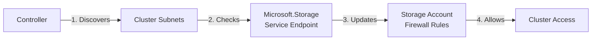
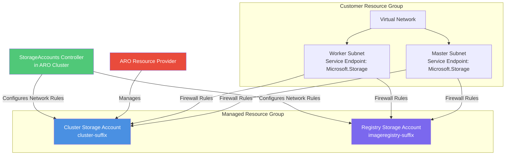
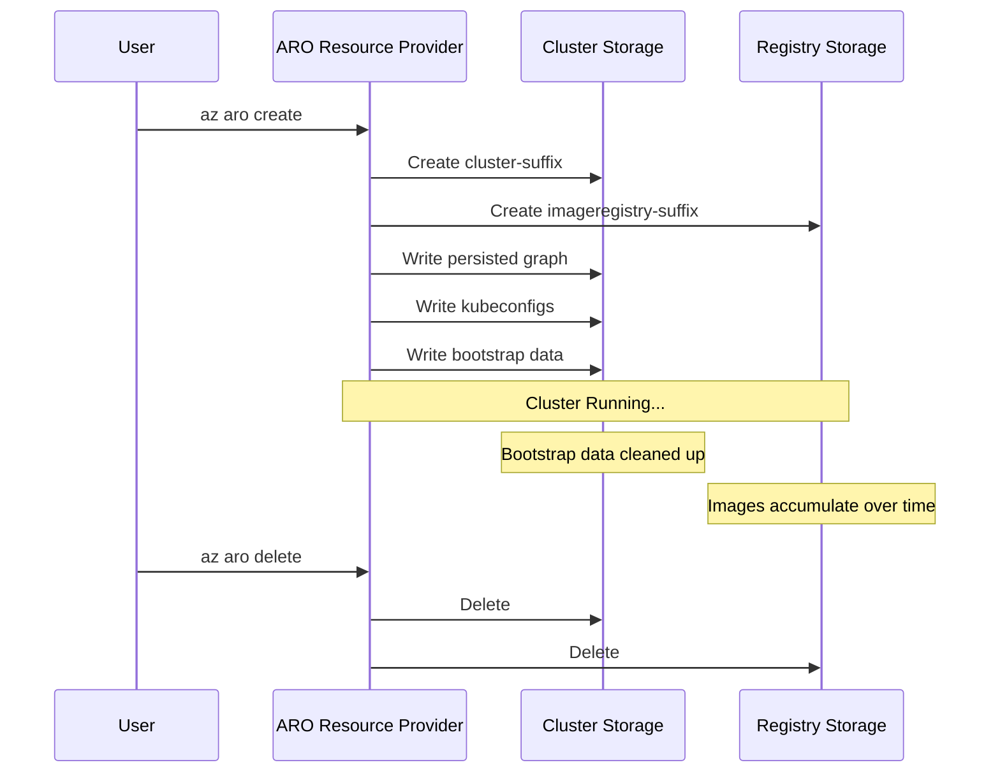

---
authors:
- diego_casati
date: '2025-12-18'
description: Ever wondered what those two storage accounts in your ARO managed resource group actually do? Let's dive into the source code to find out.
tags:
- azure
- aro
- openshift
- kubernetes
- storage
title: "ARO Storage Accounts: Under the Hood"
---

# ARO Storage Accounts: Under the Hood

You create an Azure Red Hat OpenShift cluster, and minutes later, you notice something interesting in the managed resource group: two storage accounts with cryptic names like `cluster1a2b3c4d5e` and `imageregistry1a2b3c4d5e`.

What are they for? Why two? And what happens if you accidentally delete one?

<!-- truncate -->

If you've ever deployed an ARO cluster, you've probably noticed these mysterious storage accounts appearing in the managed resource group. One has "cluster" in the name, the other has "imageregistry" - but what exactly do they store? And more importantly, why does ARO need them when most Kubernetes distributions don't require dedicated storage accounts at all?

Let's dig into the ARO-RP source code to understand exactly what's happening under the hood.

## The Two Storage Accounts

When ARO creates your cluster, it provisions **two storage accounts** in the managed resource group:

1. **`cluster{StorageSuffix}`** - The cluster storage account
2. **`imageregistry{StorageSuffix}`** - The image registry storage account

That random suffix? It's a **10-character lowercase alphanumeric string with no vowels** - a clever trick to avoid accidentally generating offensive words. Here's how it's generated in the ARO-RP code:

```go
func mutateStorageSuffix(doc *api.OpenShiftClusterDocument) error {
    err := setDocStorageSuffix(doc)
    if err != nil {
        return err
    }

    // Image registry storage account name is based on the same suffix
    doc.OpenShiftCluster.Properties.ImageRegistryStorageAccountName = 
        "imageregistry" + doc.OpenShiftCluster.Properties.StorageSuffix

    return nil
}
```

*Source: [`pkg/cluster/storageSuffix.go`](https://github.com/Azure/ARO-RP/blob/master/pkg/cluster/storageSuffix.go)*

But why two separate accounts? Let's explore what each one does.

## Storage Account #1: The Cluster Storage Account

### What's Inside?

The cluster storage account is like the brain of your ARO cluster - it stores critical metadata that the cluster needs to function:

| What | Why It Matters |
|------|----------------|
| **Persisted Graph** | The cluster's installation blueprint - configuration, certificates, and bootstrap state |
| **SRE Kubeconfig** | How Microsoft SREs can access your cluster for support (if you've granted them access) |
| **User Admin Kubeconfig** | Your cluster admin credentials |
| **Bootstrap Resources** | Temporary files used during cluster creation (cleaned up after install) |
| **Azure File CSI Backend** | Storage backend for the `azure-file` storage class |

### The Persisted Graph: Encrypted State

Here's something interesting - the persisted graph isn't just dumped as plain JSON. It's encrypted using **ChaCha20-Poly1305** with keys stored in Azure Key Vault:

```go
func (m *manager) loadPersisted(ctx context.Context, resourceGroup, account string) (PersistedGraph, error) {
    // Download the encrypted blob
    rc, err := blobService.DownloadStream(ctx, GraphContainer, GraphBlob, nil)
    if err != nil {
        return nil, err
    }
    defer rc.Body.Close()

    b, err := io.ReadAll(rc.Body)
    if err != nil {
        return nil, err
    }

    // Decrypt using AEAD (ChaCha20-Poly1305)
    b, err = m.aead.Open(b)
    if err != nil {
        return nil, err
    }

    var pg PersistedGraph
    err = json.Unmarshal(b, &pg)
    return pg, nil
}
```

*Source: [`pkg/cluster/graph/manager.go`](https://github.com/Azure/ARO-RP/blob/master/pkg/cluster/graph/manager.go)*

This means even if someone gains access to your storage account, they can't read the cluster's configuration without the encryption keys from Key Vault. Pretty clever security design.

## Storage Account #2: The Image Registry

This one's more straightforward - it backs the OpenShift **internal container registry**. When you run:

```bash
oc new-build https://github.com/sclorg/nodejs-ex
```

Where do those images go? Right into this storage account, in the `image-registry` blob container.

The registry storage account stores:
- **Container images** pushed to the internal registry
- **Image layers** (blobs)
- **Manifests and tags**

Unlike the cluster storage account, this one grows over time as you build and push more images.

## The Secret Sauce: Dynamic Network Rules

Here's where things get really interesting. Both storage accounts are created with **firewall enabled by default** (`DefaultAction: Deny`). But if the firewall blocks everything, how do the cluster nodes access them?

Enter the **StorageAccounts controller** - an operator that runs inside your ARO cluster and continuously manages firewall rules. Here's how it works:



The controller reconciles every few minutes, checking:

1. Which subnets exist in the cluster (master, worker, and any additional nodepools)
2. Which of those subnets have the `Microsoft.Storage` service endpoint enabled
3. Whether those subnets are already in the storage account firewall rules
4. If not, it adds them automatically

Here's the actual code that does this magic:

```go
func (r *reconcileManager) reconcileAccounts(ctx context.Context) error {
    // Get all cluster subnets
    subnets, err := r.kubeSubnets.List(ctx)
    
    // Check each subnet for Microsoft.Storage service endpoint
    for _, subnet := range subnets {
        armSubnet, err := r.subnets.Get(ctx, resourceGroupName, vnetName, subnetName, nil)
        
        for _, serviceEndpoint := range armSubnet.Properties.ServiceEndpoints {
            isStorageEndpoint := (serviceEndpoint.Service != nil) && 
                                (*serviceEndpoint.Service == "Microsoft.Storage")
            
            if isStorageEndpoint && matchesClusterLocation {
                serviceSubnets = append(serviceSubnets, subnet.ResourceID)
            }
        }
    }

    // Update both storage accounts
    storageAccounts := []string{
        "cluster" + r.instance.Spec.StorageSuffix,
        rc.Spec.Storage.Azure.AccountName, // registry
    }

    for _, accountName := range storageAccounts {
        // Add missing subnet rules...
    }
}
```

*Source: [`pkg/operator/controllers/storageaccounts/storageaccounts.go`](https://github.com/Azure/ARO-RP/blob/master/pkg/operator/controllers/storageaccounts/storageaccounts.go)*

This is why the **Microsoft.Storage service endpoint** is a hard requirement on your ARO subnets. Without it, the controller can't add firewall rules, and your cluster can't access its own storage accounts.

## Architecture: How It All Fits Together



## Workload Identity Changes Everything

If you're using ARO with **Workload Identity** (managed identities for pods), the storage accounts behave differently:

```go
// For Workload Identity clusters: disable shared key access
if m.doc.OpenShiftCluster.UsesWorkloadIdentity() {
    sa.AllowSharedKeyAccess = pointerutils.ToPtr(false)
    if setSasPolicy {
        sa.SasPolicy = &mgmtstorage.SasPolicy{
            SasExpirationPeriod: pointerutils.ToPtr("0.01:00:00"),
            ExpirationAction:    pointerutils.ToPtr("Log"),
        }
    }
}
```

*Source: [`pkg/cluster/deploybaseresources_additional.go`](https://github.com/Azure/ARO-RP/blob/master/pkg/cluster/deploybaseresources_additional.go)*

What does this mean?

- **Shared key access is disabled** on the cluster storage account
- **Azure File CSI** uses managed identity instead of storage account keys
- **SAS tokens expire in 1 hour** with logging enabled
- Much better security posture - no shared secrets floating around

:::info Workload Identity Prerequisite
To use Azure File with Workload Identity, you need **Azure File CSI driver v1.28.0 or later**. Earlier versions don't support managed identity authentication.
:::

## Security Best Practices

| Practice | Why |
|----------|-----|
| **Never modify directly** | The ARO Resource Provider manages these - manual changes can break your cluster |
| **Enable diagnostic logging** | Track access patterns and detect anomalies |
| **Monitor storage metrics** | Unusual growth or access patterns may indicate issues |
| **Don't disable firewall** | Those VNet rules exist for a reason |

:::warning Don't Touch the Managed Resources
Seriously, don't manually modify anything in the ARO managed resource group unless Microsoft Support explicitly tells you to. The ARO-RP expects things to be in a specific state, and manual changes can cause weird, hard-to-debug issues.
:::

## The Lifecycle Story

Let's trace what happens to these storage accounts throughout a cluster's life:



Notice that bootstrap resources are cleaned up after installation - they're only needed to get the cluster running. Everything else persists for the lifetime of the cluster.

## What We Learned

1. **The cluster storage account** is where ARO stores critical metadata - the persisted graph, kubeconfigs, and Azure File CSI backend. It's encrypted at rest using ChaCha20-Poly1305.

2. **The registry storage account** backs OpenShift's internal container registry. This is where your built images live.

3. **A Kubernetes operator inside your cluster** (the StorageAccounts controller) continuously manages firewall rules, automatically adding new subnets that have the Microsoft.Storage service endpoint.

4. **Workload Identity changes the security model** - shared key access is disabled, and everything uses managed identities instead.

5. **Don't manually modify these storage accounts** - they're managed by the ARO Resource Provider and manual changes will cause problems.

## Going Deeper

Want to explore the implementation yourself? Check out these key files in the ARO-RP repository:

- [`pkg/cluster/storageSuffix.go`](https://github.com/Azure/ARO-RP/blob/master/pkg/cluster/storageSuffix.go) - Storage suffix generation
- [`pkg/cluster/deploybaseresources_additional.go`](https://github.com/Azure/ARO-RP/blob/master/pkg/cluster/deploybaseresources_additional.go) - ARM template generation
- [`pkg/cluster/graph/manager.go`](https://github.com/Azure/ARO-RP/blob/master/pkg/cluster/graph/manager.go) - Persisted graph encryption/decryption
- [`pkg/operator/controllers/storageaccounts/storageaccounts.go`](https://github.com/Azure/ARO-RP/blob/master/pkg/operator/controllers/storageaccounts/storageaccounts.go) - Dynamic firewall controller

The ARO-RP codebase is entirely open source, and reading through it reveals a lot of clever architectural decisions like these.

## References

- [ARO-RP GitHub Repository](https://github.com/Azure/ARO-RP)
- [Create an Azure Red Hat OpenShift Cluster](https://learn.microsoft.com/en-us/azure/openshift/create-cluster)
- [ARO Networking Concepts](https://learn.microsoft.com/en-us/azure/openshift/concepts-networking)
- [ARO Managed Identities (Preview)](https://learn.microsoft.com/en-us/azure/openshift/howto-understand-managed-identities)
- [Azure Storage Account Security](https://learn.microsoft.com/en-us/azure/storage/common/storage-network-security)
