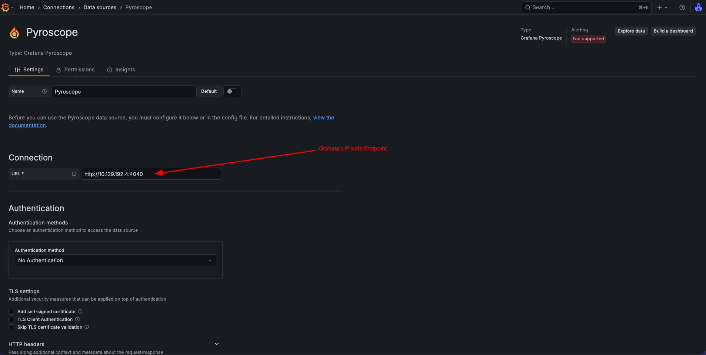
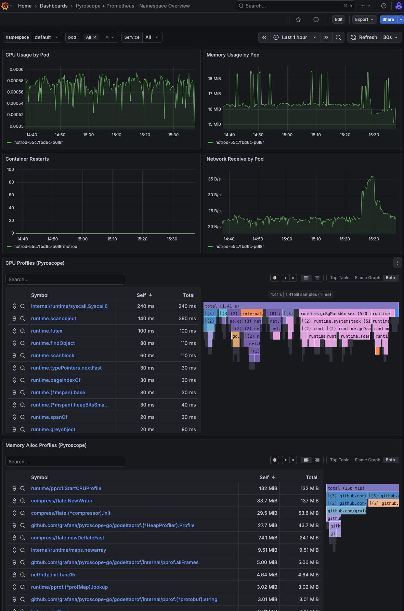
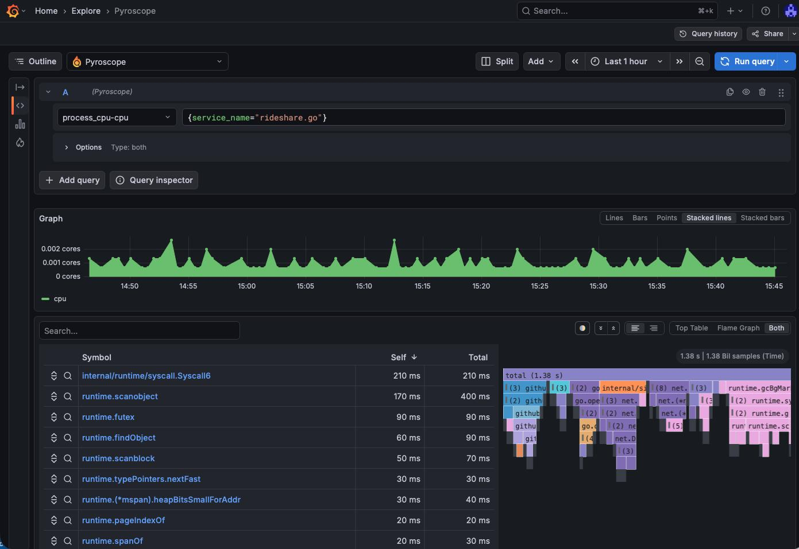

---
authors:
- diego_casati
date: '2026-05-04'
description: Deploy Grafana Pyroscope on AKS with Azure Blob Storage for long-term profile retention and Azure Managed Grafana for visualization.
tags:
- kubernetes
- aks
- observability
- profiling
title: "Continuous Profiling on AKS with Pyroscope, Blob Storage, and Managed Grafana"
---

# Continuous Profiling on AKS with Pyroscope, Blob Storage, and Managed Grafana

:::note Post Updates
**2026-05-20** — Updated based on lessons learned from a live deployment:
- Removed hardcoded `pyroscope.image.tag` from `values-azure.yaml` to prevent chart/image version mismatches when the chart is upgraded
- Added `pyroscope.extraLabels` with `azure.workload.identity/use: "true"` to propagate the label to all pod templates (the chart uses `extraLabels`, not `podLabels`)
- Pinned `--version 2.0.1` in the `helm upgrade --install` command
- Added a Troubleshooting callout documenting the two most common crash patterns and their fixes
:::

You deploy your workloads on AKS and collect metrics with Prometheus and logs with Loki. But when latency spikes hit, you stare at dashboards knowing _something_ is slow without knowing _where_ in your code the time is being spent.

That's the gap continuous profiling fills.

<!-- truncate -->

In this post we'll deploy [Grafana Pyroscope](https://grafana.com/oss/pyroscope/) on AKS, configure it to store profiles in Azure Blob Storage for durability, and connect it to Azure Managed Grafana for visualization. The end result is a production-ready profiling pipeline — no local disk dependencies, no self-managed Grafana instances.

## Architecture Overview

```
┌───────────────────────────────────────────────────────────────────────┐
│                         AKS Cluster (AKS VNet)                        │
│                                                                       │
│  ┌─────────────┐     ┌──────────────────────────────────────┐         │
│  │ Application │────>│ Pyroscope (microservices mode)       │         │
│  │   Pods      │push │  - distributor                       │         │
│  │ (SDK/agent) │     │  - ingester                          │         │
│  └─────────────┘     │  - compactor                         │         │
│                      │  - querier / query-frontend          │         │
│                      └───────┬──────────────────┬───────────┘         │
│                              │                  │                     │
│                   ┌──────────┴────────┐  ┌──────┴───────────────┐     │
│                   │ Internal LB :4040 │  │ Private Endpoint     │     │
│                   └──────────┬────────┘  │ (blob)               │     │
│                              │           └──────┬───────────────┘     │
│                   ┌──────────┴────────┐         │                     │
│                   │ Private Link Svc  │         │ privatelink.blob    │
│                   └──────────┬────────┘         │ .core.windows.net   │
└──────────────────────────────┼──────────────────┼─────────────────────┘
                               │                  │
          ┌────────────────────┘                  │
          │                                       v
          │                    ┌────────────────────────────────┐
          │                    │  Azure Blob Storage            │
          │                    │  (profile blocks)              │
          │                    │  publicNetworkAccess: Disabled │
          │                    └────────────────────────────────┘
          │
          │              ┌────────────────────────────────┐
          │              │  Azure Managed Grafana         │
          │              │  (Grafana VNet)                │
          │              │                                │
          └──────────────┤  MPE ──── PLS ─── ILB ──> Pyroscope
                         │  (10.129.x.x)          query-frontend│
                         └────────────────────────────────┘

                         ┌────────────────────────────────┐
                         │  Azure Monitor Workspace       │
                         │  (Managed Prometheus)          │
                         │                                │
                         │  AMA pods ──> amw-pyroscope    │
                         └────────────────────────────────┘
```

## Prerequisites

* Azure CLI (`az`) with the `aks-preview` extension
* Helm 3
* `kubectl`
* An Azure subscription

:::info Heads up
Check out the [Tools of the Trade: Working with Multiple Clusters](2025/11/27/tools-of-the-trade-working-with-multiple-clusters) blog post. In there, I have a walkthrough on how I setup my work environment using `direnv`. I will be using that same approach here.
:::

## Create the Environment

1. Create a placeholder directory for this cluster:

```bash
mkdir -p ~/clusters/aks-pyroscope && cd ~/clusters/aks-pyroscope
```

2. Set the environment variables:

```bash
cat <<EOF> .envrc
export AKS_CLUSTER_NAME="aks-pyroscope"
export RESOURCE_GROUP="rg-aks-pyroscope"
export LOCATION="westus3"
export STORAGE_ACCOUNT="stpyroscope${RANDOM}"
export STORAGE_CONTAINER="pyroscope"
export GRAFANA_NAME="grafana-pyroscope"
export IDENTITY_NAME="id-pyroscope"
export PYROSCOPE_NAMESPACE="pyroscope"
export PYROSCOPE_SA="pyroscope-sa"
export KUBECONFIG=${PWD}/cluster.config
EOF
```

3. Load the environment:

```bash
source .envrc
```

4. Create the Azure Resource Group:

```bash
az group create --name ${RESOURCE_GROUP} --location ${LOCATION}
```

## Create the Storage Account

Pyroscope needs durable object storage to persist profile blocks beyond the ingester's local disk. We'll use Azure Blob Storage.

1. Create the storage account with shared key access disabled:

```bash
az storage account create \
  --name ${STORAGE_ACCOUNT} \
  --resource-group ${RESOURCE_GROUP} \
  --location ${LOCATION} \
  --sku Standard_LRS \
  --kind StorageV2 \
  --allow-shared-key-access false
```

2. Create the blob container:

```bash
az storage container create \
  --name ${STORAGE_CONTAINER} \
  --account-name ${STORAGE_ACCOUNT} \
  --auth-mode login
```

## Create the AKS Cluster

```bash
az aks create \
  --name ${AKS_CLUSTER_NAME} \
  --resource-group ${RESOURCE_GROUP} \
  --node-count 3 \
  --node-vm-size Standard_D4s_v5 \
  --enable-oidc-issuer \
  --enable-workload-identity \
  --generate-ssh-keys
```

Retrieve credentials:

```bash
az aks get-credentials \
  --name ${AKS_CLUSTER_NAME} \
  --resource-group ${RESOURCE_GROUP} \
  --file ${KUBECONFIG}
```

Verify:

```bash
kubectl get nodes -o wide
```

## Configure Workload Identity for Pyroscope

Pyroscope pods need to authenticate to Azure Blob Storage without secrets. We'll use AKS Workload Identity to federate a Kubernetes service account with an Azure Managed Identity that has the `Storage Blob Data Contributor` role.

1. Create the managed identity:

```bash
az identity create \
  --name ${IDENTITY_NAME} \
  --resource-group ${RESOURCE_GROUP} \
  --location ${LOCATION}
```

2. Get the identity's client ID and principal ID:

```bash
export IDENTITY_CLIENT_ID=$(az identity show \
  --name ${IDENTITY_NAME} \
  --resource-group ${RESOURCE_GROUP} \
  --query clientId -o tsv)

export IDENTITY_PRINCIPAL_ID=$(az identity show \
  --name ${IDENTITY_NAME} \
  --resource-group ${RESOURCE_GROUP} \
  --query principalId -o tsv)
```

3. Assign `Storage Blob Data Contributor` on the storage account:

```bash
export STORAGE_ACCOUNT_ID=$(az storage account show \
  --name ${STORAGE_ACCOUNT} \
  --resource-group ${RESOURCE_GROUP} \
  --query id -o tsv)

az role assignment create \
  --assignee-object-id ${IDENTITY_PRINCIPAL_ID} \
  --assignee-principal-type ServicePrincipal \
  --role "Storage Blob Data Contributor" \
  --scope ${STORAGE_ACCOUNT_ID}
```

4. Get the OIDC issuer URL for the AKS cluster:

```bash
export AKS_OIDC_ISSUER=$(az aks show \
  --name ${AKS_CLUSTER_NAME} \
  --resource-group ${RESOURCE_GROUP} \
  --query "oidcIssuerProfile.issuerUrl" -o tsv)
```

5. Create the Kubernetes namespace and service account:

```bash
kubectl create namespace ${PYROSCOPE_NAMESPACE}

cat <<EOF | kubectl apply -f -
apiVersion: v1
kind: ServiceAccount
metadata:
  name: ${PYROSCOPE_SA}
  namespace: ${PYROSCOPE_NAMESPACE}
  annotations:
    azure.workload.identity/client-id: "${IDENTITY_CLIENT_ID}"
  labels:
    azure.workload.identity/use: "true"
EOF
```

6. Create the federated identity credential (this is what links the K8s SA to the Azure identity):

```bash
az identity federated-credential create \
  --name "pyroscope-federated" \
  --identity-name ${IDENTITY_NAME} \
  --resource-group ${RESOURCE_GROUP} \
  --issuer ${AKS_OIDC_ISSUER} \
  --subject "system:serviceaccount:${PYROSCOPE_NAMESPACE}:${PYROSCOPE_SA}" \
  --audiences "api://AzureADTokenExchange"
```

:::info Why Storage Blob Data Contributor?
Pyroscope needs to read *and* write blocks (profile data, compacted blocks, tenant indices). `Storage Blob Data Reader` alone won't work — the compactor and ingesters perform write operations.
:::

## Deploy Pyroscope

We'll deploy Pyroscope in **microservices mode** — this splits the workload into independently scalable components (distributor, ingester, compactor, querier, query-frontend, store-gateway). This architecture is based on the proven layout from the [ig-gpu-instructions](https://github.com/inspektor-gadget/ig-gpu-instructions/tree/main/kubernetes) project, adapted for Azure Blob Storage with Workload Identity authentication.

### Add the Grafana Helm repository

```bash
helm repo add grafana https://grafana.github.io/helm-charts
helm repo update
```

### Prepare the Helm values

We use a layered values approach: a base microservices topology file plus an Azure-specific override.

Create `values-micro-services.yaml` with the component layout and resource requests:

```bash
cat <<EOF> values-micro-services.yaml
# values-micro-services.yaml
# Based on: https://github.com/inspektor-gadget/ig-gpu-instructions/blob/main/kubernetes/charts/values-micro-services.yaml
pyroscope:
  extraArgs:
    store-gateway.sharding-ring.replication-factor: "1"
  components:
    querier:
      kind: Deployment
      replicaCount: 1
      resources:
        limits:
          memory: 1Gi
        requests:
          memory: 256Mi
          cpu: 100m
    query-frontend:
      kind: Deployment
      replicaCount: 1
      resources:
        limits:
          memory: 1Gi
        requests:
          memory: 256Mi
          cpu: 100m
    query-scheduler:
      kind: Deployment
      replicaCount: 1
      resources:
        limits:
          memory: 1Gi
        requests:
          memory: 256Mi
          cpu: 100m
    distributor:
      kind: Deployment
      replicaCount: 2
      resources:
        limits:
          memory: 1Gi
        requests:
          memory: 256Mi
          cpu: 500m
    ingester:
      kind: StatefulSet
      replicaCount: 3
      terminationGracePeriodSeconds: 600
      resources:
        limits:
          memory: 16Gi
        requests:
          memory: 8Gi
          cpu: 1
    compactor:
      kind: StatefulSet
      replicaCount: 3
      terminationGracePeriodSeconds: 1200
      persistence:
        enabled: false
      resources:
        limits:
          memory: 16Gi
        requests:
          memory: 8Gi
          cpu: 1
    store-gateway:
      kind: StatefulSet
      replicaCount: 1
      persistence:
        enabled: false
      resources:
        limits:
          memory: 16Gi
        requests:
          memory: 8Gi
          cpu: 1
      readinessProbe:
        initialDelaySeconds: 60
    ad-hoc-profiles:
      replicaCount: 0
    tenant-settings:
      replicaCount: 0
EOF
```

:::note Resource scaling
The values above are sized for a single-node or dev/test cluster. For **production workloads**, increase ingester/compactor/store-gateway memory to 8Gi requests, run 3+ replicas, and set `store-gateway.sharding-ring.replication-factor` to match the store-gateway replica count.
:::

:::warning Troubleshooting: "too many unhealthy instances in the ring"
This error occurs when the `store-gateway.sharding-ring.replication-factor` exceeds the number of running store-gateway instances. The querier expects N healthy ring members but finds fewer. Fix by ensuring the replication factor ≤ store-gateway replica count. This value must be consistent across all components — the Helm `pyroscope.extraArgs` block sets it globally, but verify with:

```bash
kubectl -n pyroscope get deploy pyroscope-querier \
  -o jsonpath='{.spec.template.spec.containers[0].args}' | grep replication
```
:::

Now create `values-azure.yaml` to configure Azure Blob Storage with Workload Identity:

```bash
cat <<EOF> values-azure.yaml
# values-azure.yaml
pyroscope:
  # extraLabels propagates labels to every pod template.
  # Required for the Azure Workload Identity webhook to inject
  # AZURE_CLIENT_ID / AZURE_FEDERATED_TOKEN_FILE into pods.
  extraLabels:
    azure.workload.identity/use: "true"
  serviceAccount:
    create: false
    name: pyroscope-sa
  structuredConfig:
    self_profiling:
      disable_push: true
    storage:
      backend: azure
      azure:
        container_name: pyroscope
        account_name: ${STORAGE_ACCOUNT}
        endpoint_suffix: blob.core.windows.net

# We don't need the built-in Alloy scraper or MinIO — we have Azure Blob.
alloy:
  enabled: false
minio:
  enabled: false

# Microservices mode with storage v2 (better for scaling).
architecture:
  microservices:
    enabled: true
  storage:
    v2: true

service:
  port: 4040
EOF
```

### Install Pyroscope

Before installing, double check the actual storage account name into the values file matches the `$STORAGE_ACCOUNT` environment variable:

```bash
echo "STORAGE_ACCOUNT is $STORAGE_ACCOUNT"
awk -F': *' '/account_name/{print "values-azure.yaml is: " $2}' values-azure.yaml
```

Deploy:

```bash
helm upgrade --install pyroscope grafana/pyroscope \
  --namespace ${PYROSCOPE_NAMESPACE} \
  --values values-micro-services.yaml \
  --values values-azure.yaml \
  --version 2.0.1
```

Wait for all pods to be ready:

```bash
kubectl -n ${PYROSCOPE_NAMESPACE} get pods -w
```

:::warning Troubleshooting: pods crash immediately on startup
Two common crash patterns and their fixes:

**`flag provided but not defined: -query-backend.address`** — The Helm chart version and the container image version are out of sync. Chart `2.x` generates CLI flags that the `1.x` image binary doesn't recognise. Pinning `--version 2.0.1` in the install command above keeps them aligned. If you omit `--version`, always let the chart default to its own `appVersion` image by **not** hardcoding `pyroscope.image.tag` in your values.

**`WorkloadIdentityCredential: no client ID specified`** — The Azure Workload Identity webhook injects `AZURE_CLIENT_ID`, `AZURE_TENANT_ID`, and `AZURE_FEDERATED_TOKEN_FILE` only when the **pod template** carries the label `azure.workload.identity/use: "true"`. Annotating the ServiceAccount is necessary but not sufficient. The `pyroscope.extraLabels` block in `values-azure.yaml` above propagates the label to every pod template via the Helm chart. If you upgrade an existing release that was deployed without this label, patch all workloads and delete any stuck StatefulSet pods to force recreation:

```bash
for r in $(kubectl get deployments,statefulsets -n pyroscope -o name); do
  kubectl patch $r -n pyroscope \
    --type=merge \
    -p '{"spec":{"template":{"metadata":{"labels":{"azure.workload.identity/use":"true"}}}}}'
done
```
:::

Expected output:

```
NAME                                           READY   STATUS    RESTARTS   AGE
pyroscope-compactor-0                          1/1     Running   0          3m
pyroscope-compactor-1                          1/1     Running   0          3m
pyroscope-compactor-2                          1/1     Running   0          3m
pyroscope-distributor-5b49c774f5-7vqzp         1/1     Running   0          3m
pyroscope-distributor-5b49c774f5-ldhhw         1/1     Running   0          3m
pyroscope-ingester-0                           1/1     Running   0          3m
pyroscope-ingester-1                           1/1     Running   0          3m
pyroscope-ingester-2                           1/1     Running   0          3m
pyroscope-querier-55b58bccfb-whscl             1/1     Running   0          3m
pyroscope-query-frontend-5958779869-tgfzr      1/1     Running   0          3m
pyroscope-query-scheduler-654d8bc555-44jr9     1/1     Running   0          3m
pyroscope-store-gateway-0                      1/1     Running   0          3m
```

### Verify storage connectivity

Check the ingester logs for successful block uploads:

```bash
kubectl -n ${PYROSCOPE_NAMESPACE} logs -l app.kubernetes.io/component=ingester --tail=50 | grep -i "azure\|upload\|block"
```

You should see log lines indicating blocks are being flushed to Azure Blob Storage. If you see authentication errors, verify the federated credential subject matches your service account:

```bash
az identity federated-credential show \
  --name "pyroscope-federated" \
  --identity-name ${IDENTITY_NAME} \
  --resource-group ${RESOURCE_GROUP}
```

## Configure Private Endpoint for Blob Storage

If your subscription enforces `publicNetworkAccess: Disabled` on storage accounts (e.g., via Azure Policy), the Pyroscope pods will get **403 AuthorizationFailure** when trying to read or write profile blocks. To fix this, create a private endpoint for blob storage on the AKS subnet.

1. Get the AKS node resource group and VNet:

```bash
export AKS_NODE_RG=$(az aks show \
  --name ${AKS_CLUSTER_NAME} \
  --resource-group ${RESOURCE_GROUP} \
  --query "nodeResourceGroup" -o tsv)

export AKS_VNET=$(az network vnet list \
  -g ${AKS_NODE_RG} \
  --query "[0].name" -o tsv)

export AKS_SUBNET_ID=$(az network vnet subnet show \
  -g ${AKS_NODE_RG} \
  --vnet-name ${AKS_VNET} \
  -n aks-subnet \
  --query "id" -o tsv)
```

2. Create the private endpoint:

```bash
STORAGE_ID=$(az storage account show \
  --name ${STORAGE_ACCOUNT} \
  --query "id" -o tsv)

az network private-endpoint create \
  --name pe-${STORAGE_ACCOUNT}-blob \
  --resource-group ${RESOURCE_GROUP} \
  --subnet ${AKS_SUBNET_ID} \
  --private-connection-resource-id ${STORAGE_ID} \
  --group-id blob \
  --connection-name pec-${STORAGE_ACCOUNT}-blob \
  --location ${LOCATION}
```

3. Create (or reuse) a private DNS zone and link it to the AKS VNet:

```bash
# Create the zone if it doesn't exist in your subscription
az network private-dns zone create \
  --resource-group ${RESOURCE_GROUP} \
  --name privatelink.blob.core.windows.net 2>/dev/null || true

# Link the AKS VNet
az network private-dns link vnet create \
  --resource-group ${RESOURCE_GROUP} \
  --zone-name privatelink.blob.core.windows.net \
  --name link-aks-pyroscope \
  --virtual-network ${AKS_SUBNET_ID%/subnets/*} \
  --registration-enabled false
```

4. Register the private endpoint with the DNS zone:

```bash
az network private-endpoint dns-zone-group create \
  --resource-group ${RESOURCE_GROUP} \
  --endpoint-name pe-${STORAGE_ACCOUNT}-blob \
  --name blob-dns-group \
  --private-dns-zone privatelink.blob.core.windows.net \
  --zone-name privatelink-blob
```

5. Verify DNS resolution from inside the cluster:

```bash
kubectl run dns-test --image=busybox --rm -it --restart=Never -- \
  nslookup ${STORAGE_ACCOUNT}.blob.core.windows.net
```

::::note
The response should resolve to a `10.x.x.x` private IP (the private endpoint address), not a public IP. Only as a last resort, IF CoreDNS has cached the old (public) result, wait a few minutes or restart CoreDNS:

```bash
kubectl rollout restart deployment coredns -n kube-system
```
::::

## Deploy Azure Managed Grafana

1. Create the Managed Grafana instance (Standard tier required for Pyroscope data source):

```bash
az grafana create \
  --name ${GRAFANA_NAME} \
  --resource-group ${RESOURCE_GROUP} \
  --sku-tier Standard
```

:::note
If this is the first time you run the `az grafana create` command, you will be prompted to run `az config set extension.dynamic_install_allow_preview=true` first. This command requires the `amg` extension.
:::

2. Retrieve the Grafana endpoint:

```bash
export GRAFANA_URL=$(az grafana show \
  --name ${GRAFANA_NAME} \
  --resource-group ${RESOURCE_GROUP} \
  --query "properties.endpoint" -o tsv)

echo "Grafana URL: ${GRAFANA_URL}"
```

## Connect Pyroscope to Managed Grafana

Azure Managed Grafana is a PaaS service that runs **outside** your cluster's VNet. It cannot directly reach the internal load balancer IP. We need to create a private network path using:

1. An **internal LoadBalancer** service exposing Pyroscope's query-frontend
2. A **Private Link Service (PLS)** attached to that internal LB
3. A **Managed Private Endpoint (MPE)** from Grafana to the PLS

This gives Grafana a secure, private connection into your cluster without exposing anything publicly.

### Step 1: Expose Pyroscope query-frontend via internal LB

Create an internal LoadBalancer service:

```yaml
cat <<EOF> pyroscope-internal-lb.yaml
# pyroscope-internal-lb.yaml
apiVersion: v1
kind: Service
metadata:
  name: pyroscope-query-frontend-internal
  namespace: pyroscope
  annotations:
    service.beta.kubernetes.io/azure-load-balancer-internal: "true"
spec:
  type: LoadBalancer
  selector:
    app.kubernetes.io/component: query-frontend
    app.kubernetes.io/name: pyroscope
  ports:
    - port: 4040
      targetPort: 4040
      protocol: TCP
EOF
```

```bash
kubectl apply -f pyroscope-internal-lb.yaml

# Wait for the IP to be assigned
kubectl -n ${PYROSCOPE_NAMESPACE} get svc pyroscope-query-frontend-internal -w
```

Note the internal IP — we'll use it to verify connectivity later, but Grafana won't use this IP directly.

### Step 2: Create a Private Link Service

The PLS sits in front of the AKS internal load balancer and allows services outside the VNet to connect through Azure Private Link.

First, disable Private Link Service network policies on the AKS subnet:

```bash
# Get the AKS node resource group and VNet
export NODE_RG=$(az aks show --name ${AKS_CLUSTER_NAME} \
  --resource-group ${RESOURCE_GROUP} --query nodeResourceGroup -o tsv)

export AKS_VNET=$(az network vnet list -g ${NODE_RG} --query "[0].name" -o tsv)

# Disable PLS network policies
az network vnet subnet update \
  --name aks-subnet \
  --vnet-name ${AKS_VNET} \
  --resource-group ${NODE_RG} \
  --private-link-service-network-policies Disabled
```

Get the internal LB frontend IP configuration name:

```bash
export LB_FRONTEND=$(az network lb frontend-ip list \
  --lb-name kubernetes-internal \
  -g ${NODE_RG} \
  --query "[?privateIPAddress!=null].name" -o tsv)

echo "Frontend IP config: ${LB_FRONTEND}"
```

Create the Private Link Service:

```bash
export SUBNET_ID=$(az network vnet subnet show \
  --name aks-subnet --vnet-name ${AKS_VNET} \
  -g ${NODE_RG} --query id -o tsv)

az network private-link-service create \
  --name pls-pyroscope \
  --resource-group ${NODE_RG} \
  --location ${LOCATION} \
  --lb-name kubernetes-internal \
  --lb-frontend-ip-configs ${LB_FRONTEND} \
  --subnet ${SUBNET_ID}
```

### Step 3: Create a Managed Private Endpoint from Grafana

This creates a private endpoint inside Managed Grafana that connects to the PLS:

```bash
export PLS_ID=$(az network private-link-service show \
  --name pls-pyroscope -g ${NODE_RG} --query id -o tsv)

az grafana mpe create \
  --name mpe-pyroscope \
  --resource-group ${RESOURCE_GROUP} \
  --workspace-name ${GRAFANA_NAME} \
  --private-link-resource-id ${PLS_ID} \
  --private-link-resource-region ${LOCATION}
```

### Step 4: Approve the private endpoint connection

The PLS receives the connection request in a "Pending" state. Approve it:

```bash
# Get the PE connection name
export PE_CONNECTION=$(az network private-link-service show \
  --name pls-pyroscope -g ${NODE_RG} \
  --query "privateEndpointConnections[0].name" -o tsv)

az network private-link-service connection update \
  --service-name pls-pyroscope \
  --resource-group ${NODE_RG} \
  --name ${PE_CONNECTION} \
  --connection-status Approved
```

Verify the connection is approved on both sides:

```bash
# PLS side
az network private-link-service show --name pls-pyroscope -g ${NODE_RG} \
  --query "privateEndpointConnections[].privateLinkServiceConnectionState.status" -o tsv

# Grafana MPE side (may take a few minutes to reflect)
az grafana mpe show --name mpe-pyroscope \
  -g ${RESOURCE_GROUP} --workspace-name ${GRAFANA_NAME} \
  --query connectionState.status -o tsv
```

Both should return `Approved`.

:::tip
If the Grafana MPE status remains `Pending` for more than a few minutes after approving on the PLS side, force a refresh:

```bash
az grafana mpe refresh -g ${RESOURCE_GROUP} --workspace-name ${GRAFANA_NAME}
```

The Grafana RP doesn't poll the PLS continuously — this command triggers an immediate sync.
:::

### Step 5: Add the Pyroscope data source

With the private endpoint active, Grafana can reach Pyroscope through the **MPE's private IP** — not the AKS internal LB IP directly. The internal LB IP (`10.224.0.x`) lives in the AKS VNet and is unreachable from Grafana's managed VNet. The MPE provides a NAT'd IP inside Grafana's network that tunnels traffic through the PLS to the internal LB.

Retrieve the MPE private IP:

```bash
export MPE_IP=$(az grafana mpe show \
  --name mpe-pyroscope \
  -g ${RESOURCE_GROUP} \
  --workspace-name ${GRAFANA_NAME} \
  --query privateLinkServicePrivateIP -o tsv)

echo "Grafana will reach Pyroscope via: ${MPE_IP}:4040"
```

Create the data source using the MPE IP:

```bash
az grafana data-source create \
  --name ${GRAFANA_NAME} \
  --resource-group ${RESOURCE_GROUP} \
  --definition '{
    "name": "Pyroscope",
    "type": "grafana-pyroscope-datasource",
    "url": "http://'"${MPE_IP}"':4040",
    "access": "proxy"
  }'
```

:::warning Common mistake
Using the AKS internal LB IP (e.g., `10.224.0.7`) as the data source URL will result in `dial tcp: i/o timeout`. Always use the MPE private IP — it's the address visible inside Grafana's managed VNet.
:::

Navigate to **Connections -> Data sources -> Pyroscope** in Managed Grafana and click "Save & test" to confirm connectivity.



## Test: Profile a Sample Application

The Pyroscope repo includes a Go "rideshare" example that pushes CPU and memory profiles. There is no prebuilt image on Docker Hub, so we build and push it to an Azure Container Registry (ACR):

```bash
# Clone the example and build the image
git clone --depth 1 https://github.com/grafana/pyroscope.git /tmp/pyroscope
cd /tmp/pyroscope/examples/language-sdk-instrumentation/golang-push/rideshare

# Build and push to ACR (assumes ACR is attached to the AKS cluster)
export ACR_NAME=<your-acr-name>
az acr build --registry ${ACR_NAME} --image rideshare-go:latest .
```

:::tip
If you don't have an ACR, you can create one and attach it to AKS:

```bash
az acr create -n ${ACR_NAME} -g ${RESOURCE_GROUP} --sku Basic
az aks update -n ${AKS_CLUSTER_NAME} -g ${RESOURCE_GROUP} --attach-acr ${ACR_NAME}
```
:::

Deploy the sample app:

```bash
cat <<EOF> sample-app.yaml
# sample-app.yaml
apiVersion: apps/v1
kind: Deployment
metadata:
  name: hotrod
  namespace: default
spec:
  replicas: 1
  selector:
    matchLabels:
      app: hotrod
  template:
    metadata:
      labels:
        app: hotrod
      annotations:
        profiles.grafana.com/memory.scrape: "true"
        profiles.grafana.com/memory.port: "6060"
        profiles.grafana.com/cpu.scrape: "true"
        profiles.grafana.com/cpu.port: "6060"
    spec:
      containers:
        - name: hotrod
          image: <your-acr-name>.azurecr.io/rideshare-go:latest
          env:
            - name: PYROSCOPE_SERVER_ADDRESS
              value: "http://pyroscope-distributor.pyroscope.svc.cluster.local:4040"
            - name: REGION
              value: "us-east"
          ports:
            - containerPort: 6060
EOF
```

```bash
kubectl apply -f sample-app.yaml
```

After a minute or two, open Managed Grafana and navigate to **Explore** → select the **Pyroscope** data source. You should see `ride-sharing-app` in the application dropdown with CPU and memory profiles.

## Verify Blob Storage

Confirm that profile blocks are persisted in Azure:

```bash
az storage blob list \
  --account-name ${STORAGE_ACCOUNT} \
  --container-name ${STORAGE_CONTAINER} \
  --auth-mode login \
  --output table | head -20
```

:::note
If key-based authentication is disabled on the storage account (recommended), you must use `--auth-mode login`. Your identity needs at least the **Storage Blob Data Reader** role:

```bash
az role assignment create \
  --assignee $(az ad signed-in-user show --query id -o tsv) \
  --role "Storage Blob Data Reader" \
  --scope $(az storage account show -n ${STORAGE_ACCOUNT} -g ${RESOURCE_GROUP} --query id -o tsv)
```
:::

You should see block files (parquet/JSON metadata) being written by the compactor and ingesters.

## Add Managed Prometheus for Metrics Correlation

While Pyroscope handles profiling independently, adding Azure Managed Prometheus gives you metrics (CPU %, memory usage, request rates) alongside flame graphs — letting you correlate "what spiked" with "where in the code."

### Create an Azure Monitor Workspace

```bash
az monitor account create \
  --name amw-pyroscope \
  --resource-group ${RESOURCE_GROUP} \
  --location ${LOCATION}
```

### Enable metrics collection on the AKS cluster

Retrieve the Azure Monitor Workspace ID and the Grafana resource ID, then update the cluster. Passing `--grafana-resource-id` links Grafana to the workspace and auto-provisions the Prometheus data source:

```bash
export AMW_ID=$(az monitor account show \
  --name amw-pyroscope -g ${RESOURCE_GROUP} --query id -o tsv)

export GRAFANA_RESOURCE_ID=$(az grafana show \
  --name ${GRAFANA_NAME} -g ${RESOURCE_GROUP} --query id -o tsv)

az aks update \
  -g ${RESOURCE_GROUP} \
  -n ${AKS_CLUSTER_NAME} \
  --enable-azure-monitor-metrics \
  --azure-monitor-workspace-resource-id ${AMW_ID} \
  --grafana-resource-id ${GRAFANA_RESOURCE_ID}
```

This deploys the Azure Monitor Agent (AMA) pods into `kube-system`, which scrape Prometheus metrics from your cluster and remote-write them to the Azure Monitor workspace. It also grants the Grafana managed identity the necessary roles and creates the Prometheus data source automatically.

### Connect Managed Grafana to Prometheus

If you passed `--grafana-resource-id` during the `az aks update` above, the Prometheus data source is created automatically. If not, you can add it manually:

```bash
export GRAFANA_PRINCIPAL=$(az grafana show \
  -g ${RESOURCE_GROUP} -n ${GRAFANA_NAME} --query identity.principalId -o tsv)

az role assignment create \
  --assignee ${GRAFANA_PRINCIPAL} \
  --role "Monitoring Data Reader" \
  --scope ${AMW_ID}

az grafana data-source create \
  --name ${GRAFANA_NAME} \
  --resource-group ${RESOURCE_GROUP} \
  --definition '{
    "name": "Azure Managed Prometheus",
    "type": "prometheus",
    "url": "'"${AMW_ID}"'",
    "access": "proxy",
    "jsonData": {
      "azureCredentials": {"authType": "msi"},
      "httpMethod": "POST"
    }
  }'
```

### Creating a custom dashboard with Prometheus metrics and Flamegraphs

You can create a new custom dashboard that will display both, Prometheus metrics as well as Flamegraph information. You can see a sample dashboard [here](./pyroscope-dashboard.json) and import that into Grafana.



On this example dashboard, I've added filters for `namespace`, `pod` and `service`. 

Another option is to use the **Explore** (or Drill) option in Grafana and look directly into a pod. 



## Cleanup

```bash
az group delete --name ${RESOURCE_GROUP} --yes --no-wait
```

## Conclusion

Pyroscope on AKS with Azure Blob Storage gives you durable, scalable continuous profiling without managing local disk or worrying about data loss during pod restarts. Azure Managed Grafana (Standard tier) natively supports both the Pyroscope and Prometheus data sources, so you get a fully managed visualization layer without running your own Grafana.

Adding Managed Prometheus completes the observability picture: metrics tell you _what_ changed, profiles tell you _where in the code_ the time is spent.

## References

- [AKS Labs - Advanced Observability Concepts](https://azure-samples.github.io/aks-labs/docs/operations/observability-and-monitoring)
- [Grafana Pyroscope documentation](https://grafana.com/docs/pyroscope/latest/)
- [Pyroscope Helm chart — Kubernetes deployment](https://grafana.com/docs/pyroscope/latest/deploy-kubernetes/helm/)
- [Pyroscope configuration reference — Azure storage backend](https://grafana.com/docs/pyroscope/latest/configure-server/reference-configuration-parameters/)
- [ig-gpu-instructions — GPU observability with Pyroscope on Kubernetes](https://github.com/inspektor-gadget/ig-gpu-instructions/tree/main/kubernetes) (microservices Helm values reference)
- [Azure Managed Prometheus — overview](https://learn.microsoft.com/en-us/azure/azure-monitor/essentials/prometheus-metrics-overview)
- [Azure Managed Grafana — supported data sources](https://learn.microsoft.com/en-us/azure/managed-grafana/how-to-data-source-plugins-managed-identity)
- [Azure Managed Grafana — connect to data sources privately](https://learn.microsoft.com/en-us/azure/managed-grafana/how-to-connect-to-datasource-privately)
- [Workload Identity on AKS](https://learn.microsoft.com/en-us/azure/aks/workload-identity-overview)
