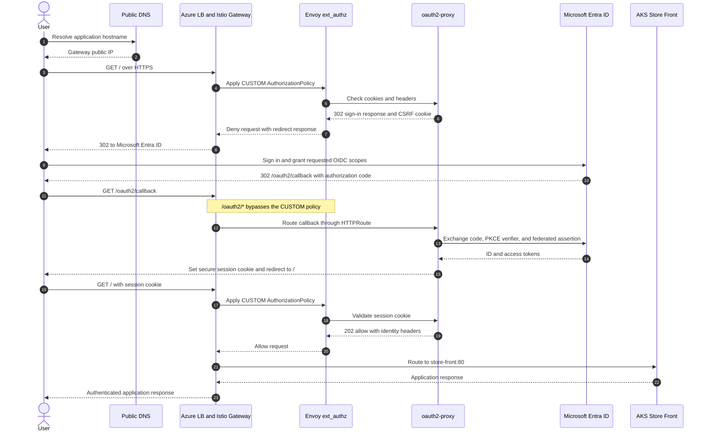

---
authors:
  - diego_casati
  - dominique_st-amand
date: '2026-07-29'
description: >
  Protect an AKS application with Istio external authorization, oauth2-proxy,
  Microsoft Entra ID, and AKS Workload Identity without an OAuth client secret.
tags:
  - kubernetes
  - aks
  - istio
  - oauth2-proxy
  - entra-id
  - workload-identity
  - gateway-api
  - security
title: "Secretless Microsoft Entra ID Authentication for AKS with Istio and oauth2-proxy"
---

# Secretless Microsoft Entra ID Authentication for AKS with Istio and oauth2-proxy

Putting an application behind an ingress gateway is straightforward. Making the
gateway enforce Microsoft Entra ID authentication without adding an OAuth client
secret is where the design gets more interesting.

In this post I'll show how I protected the
[AKS Store Demo](https://github.com/Azure-Samples/aks-store-demo) with an Istio
Gateway, oauth2-proxy, and Microsoft Entra ID. Istio delegates every protected
request to oauth2-proxy through Envoy external authorization. oauth2-proxy uses
PKCE for the user authorization flow and AKS Workload Identity to authenticate
the app registration when it redeems the authorization code.

There is no Entra application password to create, store in Kubernetes, or
rotate.

<!-- truncate -->

## Architecture

```text
                                      Microsoft Entra ID
                                  +--------------------------+
                                  | authorize + token        |
                                  | endpoints                |
                                  +------------^-------------+
                                               |
                                   code + PKCE + federated
                                      client assertion
                                               |
+----------+      HTTPS       +----------------+----------------+
| Browser  |----------------->| Azure Load Balancer             |
+----------+                  | Istio Gateway API Gateway       |
                              | TLS termination                 |
                              +----------------+----------------+
                                               |
                                      CUSTOM AuthorizationPolicy
                                               |
                                               v
                              +---------------------------------+
                              | Envoy ext_authz                 |
                              | oauth2-proxy:4180               |
                              +----------------+----------------+
                                               |
                                      request allowed
                                               |
                                               v
                              +---------------------------------+
                              | AKS Store Front                 |
                              | ClusterIP service               |
                              +---------------------------------+

AKS OIDC issuer ---- projected service account token ----> oauth2-proxy
       |                                                    |
       +---- trusted by Entra federated credential <--------+
```

The important boundary is the gateway. The store services are changed from
`LoadBalancer` to `ClusterIP`, so users cannot skip Istio and reach the
application directly.

The authentication path has two distinct identities:

1. The browser user authenticates with Microsoft Entra ID through the OpenID
   Connect authorization code flow.
2. oauth2-proxy authenticates itself to Entra with the projected Kubernetes
   service account token.

PKCE protects the authorization code. Workload Identity replaces the OAuth
client secret. They solve different problems, and this setup uses both.

## Authentication Sequence



:::warning Gateway API support with the managed Istio add-on
At the time of writing, Microsoft documents Gateway API for Istio ingress as not
yet supported with the AKS managed Istio add-on. The implementation in this post
works in the tested environment, but it is outside the currently documented
support boundary. For a supported production design, validate the latest AKS
Istio support policy or use the supported managed ingress gateway APIs.
:::

## Prerequisites

* An Azure subscription and Microsoft Entra tenant
* Azure CLI authenticated with `az login`
* Permissions to create AKS clusters, Entra applications, service principals,
  and federated credentials
* `kubectl`, Helm 3, `dig`, `openssl`, `sed`, and `base64`
* A public DNS hostname, or `sslip.io` for a quick test

The example uses these versions:

| Component | Version |
|---|---|
| Kubernetes | `1.36.1` |
| AKS managed Istio | `asm-1-29` |
| oauth2-proxy | `v7.15.2` |
| cert-manager | `v1.21.1` |

## Create the AKS Cluster

The cluster needs the OIDC issuer, Workload Identity, and Gateway API enabled.
The OIDC issuer publishes the keys Entra uses to validate projected service
account tokens.

```bash
export CLUSTER_NAME="aks-oauth2-proxy-POC-01"
export RESOURCE_GROUP="rg-oauth2-proxy-POC"
export LOCATION="westus3"
export KUBERNETES_VERSION="1.36.1"
export KUBECONFIG="${PWD}/cluster.config"

az group create \
  --name "${RESOURCE_GROUP}" \
  --location "${LOCATION}"

az aks create \
  --name "${CLUSTER_NAME}" \
  --resource-group "${RESOURCE_GROUP}" \
  --location "${LOCATION}" \
  --kubernetes-version "${KUBERNETES_VERSION}" \
  --node-count 2 \
  --node-vm-size Standard_D4s_v4 \
  --network-plugin azure \
  --network-plugin-mode overlay \
  --load-balancer-sku standard \
  --generate-ssh-keys \
  --enable-oidc-issuer \
  --enable-workload-identity \
  --enable-azure-service-mesh \
  --revision asm-1-29

az aks update \
  --name "${CLUSTER_NAME}" \
  --resource-group "${RESOURCE_GROUP}" \
  --enable-gateway-api

az aks get-credentials \
  --name "${CLUSTER_NAME}" \
  --resource-group "${RESOURCE_GROUP}" \
  --file "${KUBECONFIG}"
```

Verify the two identity features before continuing:

```bash
az aks show \
  --name "${CLUSTER_NAME}" \
  --resource-group "${RESOURCE_GROUP}" \
  --query '{oidc:oidcIssuerProfile.enabled,workloadIdentity:securityProfile.workloadIdentity.enabled,issuer:oidcIssuerProfile.issuerUrl}'
```

Both Boolean values should be `true`, and `issuer` should contain the AKS OIDC
issuer URL.

## Deploy the Store Without a Public Bypass

The upstream store manifest exposes `store-front` and `store-admin` as public
`LoadBalancer` services. That would create a second path around the authentication
policy, so I convert both to `ClusterIP`.

```bash
kubectl create namespace aks-store-demo

kubectl apply \
  --namespace aks-store-demo \
  --filename https://raw.githubusercontent.com/Azure-Samples/aks-store-demo/refs/heads/main/aks-store-all-in-one.yaml

for service in store-front store-admin; do
  kubectl patch service "${service}" \
    --namespace aks-store-demo \
    --type json \
    --patch='[
      {"op":"remove","path":"/spec/ports/0/nodePort"},
      {"op":"replace","path":"/spec/type","value":"ClusterIP"}
    ]'
done
```

Verify there is no direct public endpoint:

```bash
kubectl get service store-front store-admin \
  --namespace aks-store-demo
```

Both services should show `ClusterIP` under `TYPE`.

## Create the Entra Application

First, get the AKS issuer and tenant ID:

```bash
export OIDC_ISSUER=$(az aks show \
  --name "${CLUSTER_NAME}" \
  --resource-group "${RESOURCE_GROUP}" \
  --query oidcIssuerProfile.issuerUrl \
  --output tsv)

export TENANT_ID=$(az account show \
  --query tenantId \
  --output tsv)
```

For the first pass I use the gateway address with `sslip.io`. The deployment
script in the sample repository creates the Gateway and derives this value
automatically. If you already know the public hostname, set it directly:

```bash
export STORE_URL="https://store.example.com"
export REDIRECT_URL="${STORE_URL}/oauth2/callback"
export APP_NAME="aks-store-demo-oauth2-proxy"
```

Create a single-tenant web application and its service principal:

```bash
export CLIENT_ID=$(az ad app create \
  --display-name "${APP_NAME}" \
  --sign-in-audience AzureADMyOrg \
  --web-redirect-uris "${REDIRECT_URL}" \
  --query appId \
  --output tsv)

az ad sp create --id "${CLIENT_ID}"
```

Do not run `az ad app credential reset`. That command creates the application
password we are intentionally removing from this design.

## Federate the App Registration with Kubernetes

This is the part I initially had to look at twice. The federated credential must
be created on the oauth2-proxy app registration itself. Creating a separate
User-Assigned Managed Identity does not authenticate this confidential client.

oauth2-proxy uses the app registration's client ID and presents the projected
service account token as its client assertion.

```bash
az ad app federated-credential create \
  --id "${CLIENT_ID}" \
  --parameters "{
    \"name\": \"oauth2-proxy\",
    \"issuer\": \"${OIDC_ISSUER}\",
    \"subject\": \"system:serviceaccount:aks-store-demo:oauth2-proxy\",
    \"audiences\": [\"api://AzureADTokenExchange\"]
  }"
```

The issuer, subject, and audience must match exactly. A mismatch produces an
Entra token exchange failure even when the pod otherwise looks healthy.

## Configure the oauth2-proxy Workload Identity

The Kubernetes service account points to the Entra app registration client ID:

```yaml
apiVersion: v1
kind: ServiceAccount
metadata:
  name: oauth2-proxy
  namespace: aks-store-demo
  annotations:
    azure.workload.identity/client-id: "<entra-application-client-id>"
```

The pod must also carry the Workload Identity label:

```yaml
spec:
  template:
    metadata:
      labels:
        app: oauth2-proxy
        azure.workload.identity/use: "true"
    spec:
      serviceAccountName: oauth2-proxy
```

The AKS mutating webhook uses that label to inject the projected token volume
and the environment variables oauth2-proxy needs to find it.

:::note Restart pods after changing the service account
Workload Identity mutation happens when the pod is created. Updating the service
account annotation does not rewrite existing pods. Restart the deployment after
changing the client ID.
:::

## Configure oauth2-proxy Without a Client Secret

The key oauth2-proxy options are:

```yaml
args:
  - --provider=entra-id
  - --entra-id-federated-token-auth=true
  - --scope=openid
  - --code-challenge-method=S256
  - --upstream=static://200
  - --reverse-proxy=true
  - --cookie-secure=true
  - --cookie-samesite=lax
  - --set-xauthrequest=true
  - --pass-access-token=true
```

`--entra-id-federated-token-auth=true` tells oauth2-proxy to use the projected
Workload Identity token instead of `OAUTH2_PROXY_CLIENT_SECRET` when calling the
Entra token endpoint.

The deployment still loads a Kubernetes Secret:

```yaml
envFrom:
  - secretRef:
      name: oauth2-proxy
```

That Secret does not contain an Entra client secret. It contains the client ID,
OIDC issuer, callback URL, and the cookie encryption key:

```bash
kubectl create secret generic oauth2-proxy \
  --namespace aks-store-demo \
  --from-literal=OAUTH2_PROXY_CLIENT_ID="${CLIENT_ID}" \
  --from-literal=OAUTH2_PROXY_COOKIE_SECRET="$(openssl rand -base64 32 | tr '+/' '-_')" \
  --from-literal=OAUTH2_PROXY_OIDC_ISSUER_URL="https://login.microsoftonline.com/${TENANT_ID}/v2.0" \
  --from-literal=OAUTH2_PROXY_REDIRECT_URL="${REDIRECT_URL}"
```

The cookie secret is still sensitive because oauth2-proxy uses it to protect
browser sessions. Secretless here means there is no long-lived Entra application
credential. It does not mean the workload has no sensitive runtime state.

## Register oauth2-proxy as an Istio External Authorizer

Istio needs an extension provider that points Envoy to the oauth2-proxy service:

```yaml
apiVersion: v1
kind: ConfigMap
metadata:
  name: istio-shared-configmap-asm-1-29
  namespace: aks-istio-system
data:
  mesh: |-
    extensionProviders:
      - name: oauth2-proxy
        envoyExtAuthzHttp:
          service: oauth2-proxy.aks-store-demo.svc.cluster.local
          port: 4180
          includeRequestHeadersInCheck:
            - cookie
            - authorization
          headersToUpstreamOnAllow:
            - x-auth-request-user
            - x-auth-request-email
            - x-auth-request-access-token
            - authorization
          headersToDownstreamOnAllow:
            - set-cookie
          headersToDownstreamOnDeny:
            - set-cookie
            - content-type
            - location
```

The `location` and `set-cookie` response headers matter. Without them, Envoy can
deny the unauthenticated request but the browser will not receive the complete
sign-in redirect and CSRF cookie from oauth2-proxy.

## Apply the Authorization Policy

The Gateway routes `/oauth2` callbacks to oauth2-proxy and sends application
traffic to `store-front`:

```yaml
apiVersion: gateway.networking.k8s.io/v1
kind: HTTPRoute
metadata:
  name: store
  namespace: aks-store-demo
spec:
  parentRefs:
    - name: store-external
      sectionName: https
  hostnames:
    - "store.example.com"
  rules:
    - matches:
        - path:
            type: PathPrefix
            value: /oauth2
      backendRefs:
        - name: oauth2-proxy
          port: 4180
    - backendRefs:
        - name: store-front
          port: 80
```

The `CUSTOM` policy selects the generated Gateway workload and delegates checks
to the extension provider:

```yaml
apiVersion: security.istio.io/v1
kind: AuthorizationPolicy
metadata:
  name: store-oauth2
  namespace: aks-store-demo
spec:
  selector:
    matchLabels:
      gateway.networking.k8s.io/gateway-name: store-external
  action: CUSTOM
  provider:
    name: oauth2-proxy
  rules:
    - to:
        - operation:
            notPaths:
              - /oauth2/*
              - /.well-known/acme-challenge/*
```

The two exclusions are intentional:

* `/oauth2/*` must reach oauth2-proxy so it can start sign-in and process the
  callback.
* `/.well-known/acme-challenge/*` must remain reachable so cert-manager can issue
  and renew the certificate with HTTP-01.

Keep this list narrow. Every excluded path bypasses the external authorization
check.

## Deploy the Complete Sample

The repository includes an idempotent deployment script that creates or updates
the Entra application, direct federated credential, TLS certificate, Gateway,
routes, oauth2-proxy, and authorization policy.

```bash
export KUBECONFIG="${PWD}/cluster.config"
export RESOURCE_GROUP="rg-oauth2-proxy-POC"
export CLUSTER_NAME="aks-oauth2-proxy-POC-01"

# Omit STORE_URL to derive an sslip.io hostname from the gateway IP.
bash deploy-store.sh
```

For a custom hostname, create its public `A` record first and rerun:

```bash
export STORE_URL="https://store.example.com"
bash deploy-store.sh
```

The hostname must resolve to the Gateway address before cert-manager starts the
HTTP-01 challenge.

## Verify the Authentication Path

Check the Kubernetes resources:

```bash
kubectl get gateway,httproute \
  --namespace aks-store-demo

kubectl get pods \
  --namespace aks-store-demo \
  --selector app=oauth2-proxy

kubectl get authorizationpolicy store-oauth2 \
  --namespace aks-store-demo

kubectl get certificate store-tls \
  --namespace aks-store-demo
```

An unauthenticated request should return a redirect to Microsoft Entra ID:

```bash
curl --head "${STORE_URL}"
```

Expected result:

```text
HTTP/2 302
location: https://login.microsoftonline.com/<tenant-id>/oauth2/v2.0/authorize?...
set-cookie: _oauth2_proxy_csrf=...
```

Open the URL in a private browser window. After sign-in, Entra redirects to
`/oauth2/callback`, oauth2-proxy redeems the code with PKCE and its federated
client assertion, sets the session cookie, and redirects back to `/`.

Confirm no application password remains:

```bash
az ad app credential list \
  --id "${CLIENT_ID}" \
  --output table
```

The list should be empty unless the application has another intentionally
managed credential.

## Troubleshooting

### The callback still asks for a client secret

Confirm all three pieces are present:

```bash
kubectl get deployment oauth2-proxy \
  --namespace aks-store-demo \
  --output jsonpath='{.spec.template.spec.containers[0].args}'

kubectl get serviceaccount oauth2-proxy \
  --namespace aks-store-demo \
  --output yaml

az ad app federated-credential list \
  --id "${CLIENT_ID}" \
  --output table
```

You need `--entra-id-federated-token-auth=true`, the service account client ID
annotation, and a federated credential on the same Entra app registration.

### The pod does not have a projected token

Check the pod label and injected environment:

```bash
POD=$(kubectl get pod \
  --namespace aks-store-demo \
  --selector app=oauth2-proxy \
  --output jsonpath='{.items[0].metadata.name}')

kubectl get pod "${POD}" \
  --namespace aks-store-demo \
  --output jsonpath='{.metadata.labels.azure\.workload\.identity/use}'

kubectl exec "${POD}" \
  --namespace aks-store-demo \
  -- printenv AZURE_FEDERATED_TOKEN_FILE
```

If the label or token path is missing, fix the pod template and restart the
deployment.

### Certificate issuance redirects to sign-in

The ACME solver path is reaching the authorization policy. Confirm
`/.well-known/acme-challenge/*` is excluded and inspect the challenge:

```bash
kubectl get challenge,order,certificaterequest \
  --namespace aks-store-demo
```

### Users can reach the store without signing in

Check for another public service or ingress path:

```bash
kubectl get service,ingress,gateway,httproute \
  --all-namespaces
```

The store front and admin services should remain `ClusterIP`. Authentication at
one ingress path does not protect a second public path.

## Cleanup

```bash
kubectl delete namespace aks-store-demo

az ad app delete --id "${CLIENT_ID}"

# Remove cert-manager only if this demo installed it exclusively.
helm uninstall cert-manager --namespace cert-manager
kubectl delete namespace cert-manager

# Delete the cluster only if it was created for this exercise.
az group delete \
  --name "${RESOURCE_GROUP}" \
  --yes \
  --no-wait
```

## Conclusion

The useful part of this design is not just putting oauth2-proxy in front of an
application. It is keeping the authentication boundary at the Gateway while
removing the long-lived Entra credential from the workload.

The pieces that make it work are:

* **Istio external authorization** pauses protected requests at Envoy and sends
  them to oauth2-proxy before the application sees them.
* **ClusterIP backend services** remove alternate public paths that would bypass
  the policy.
* **PKCE** protects the browser authorization code flow.
* **AKS Workload Identity** projects a signed Kubernetes service account token
  into the oauth2-proxy pod.
* **Direct app registration federation** lets oauth2-proxy use that token as its
  client assertion when it calls Microsoft Entra ID.
* **Narrow callback and ACME exclusions** keep sign-in and certificate renewal
  working without opening the rest of the application.

The result is a conventional OpenID Connect experience for users and one less
credential for operators to rotate.

## References

- [AKS managed Istio service mesh add-on](https://learn.microsoft.com/azure/aks/istio-about)
- [AKS Istio add-on support policy](https://learn.microsoft.com/azure/aks/istio-support-policy)
- [Gateway API for Istio](https://istio.io/latest/docs/tasks/traffic-management/ingress/gateway-api/)
- [Istio external authorization](https://istio.io/latest/docs/tasks/security/authorization/authz-custom/)
- [AKS Workload Identity](https://learn.microsoft.com/azure/aks/workload-identity-overview)
- [Workload identity federation for applications](https://learn.microsoft.com/entra/workload-id/workload-identity-federation-create-trust?pivots=identity-wif-apps-methods-azcli#kubernetes-example)
- [Microsoft identity platform authorization code flow](https://learn.microsoft.com/entra/identity-platform/v2-oauth2-auth-code-flow)
- [oauth2-proxy Microsoft Entra ID provider](https://oauth2-proxy.github.io/oauth2-proxy/configuration/providers/ms_entra_id/)
- [cert-manager HTTP-01 with Gateway API](https://cert-manager.io/docs/configuration/acme/http01/)
- [AKS Store Demo](https://github.com/Azure-Samples/aks-store-demo)